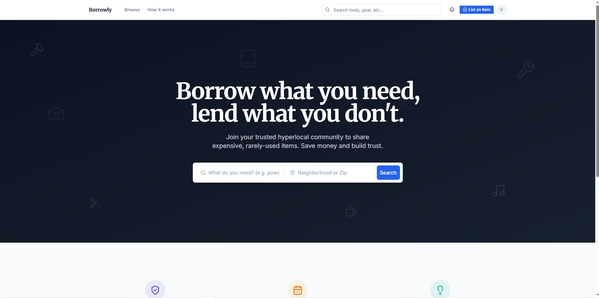
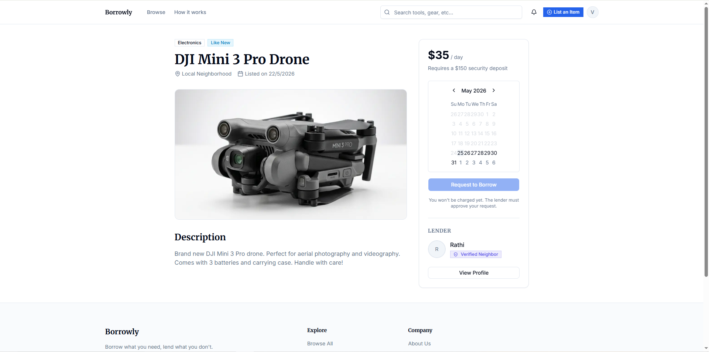
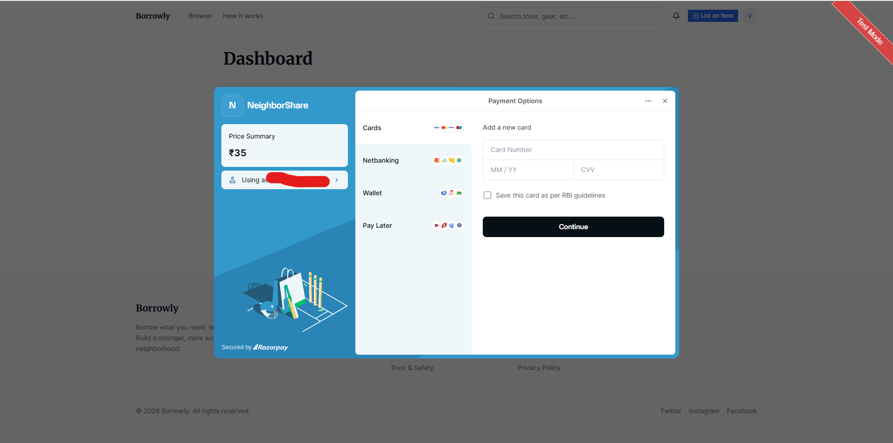
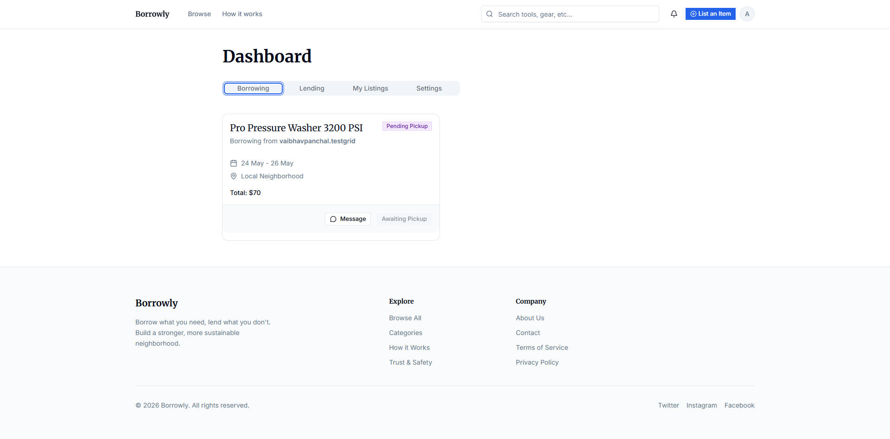

# NeighborShare Hub 

**NeighborShare Hub** is a modern, peer-to-peer neighborhood rental marketplace built with Next.js, Supabase, and Razorpay. It allows neighbors to safely rent items (like tools, electronics, and outdoor gear) to one another, fostering community and reducing waste.

## Screenshots

### Landing Page & Marketplace

*Browse available items from your local neighborhood.*

### Item Details & Booking Flow

*View item details, check availability calendars, and request a booking.*

### Secure Checkout (Razorpay)

*Process secure escrow payments using Razorpay's drop-in UI.*

### Admin Dashboard & Dispute Resolution

*Admin control center for managing user disputes and issuing refunds.*

---

## Features

- **Authentication**: Secure email/password login and profiles powered by Supabase Auth.
- **Database & Storage**: PostgreSQL schema with strict Row Level Security (RLS) for data privacy, plus Supabase Storage for listing images.
- **Real-Time Chat**: Live peer-to-peer messaging using Supabase Realtime so renters and lenders can coordinate pickups.
- **Secure Payments**: Razorpay integration with server-side HMAC signature verification. Funds are held in "escrow" until the item is safely returned.
- **Trust Scores**: Automated review system that generates a 0-5 trust score for users.
- **Dispute Resolution**: Dedicated admin dashboard for handling conflicts, issuing refunds, and banning bad actors.

## Tech Stack

- **Framework**: Next.js 14 (App Router)
- **Styling**: Tailwind CSS & shadcn/ui
- **Backend & Database**: Supabase (PostgreSQL, Auth, Storage, Realtime)
- **Payments**: Razorpay
- **Deployment**: Vercel

## Local Development

First, copy `.env.example` to `.env.local` and fill in your Supabase and Razorpay API keys.

Then, run the development server:

```bash
npm install
npm run dev
```

Open [http://localhost:3000](http://localhost:3000) with your browser to see the result.

this web app tested using [TestGrid.io](https://www.testgrid.io/)
